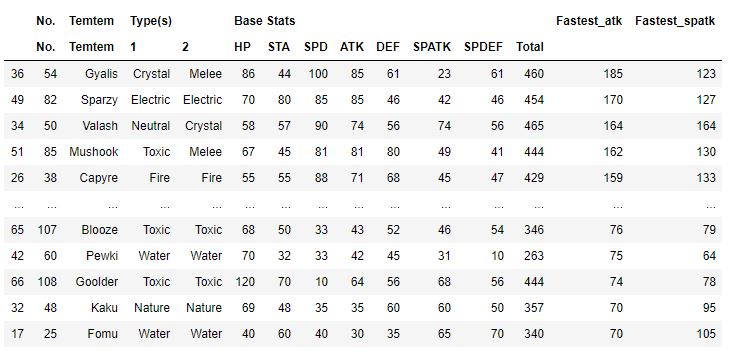
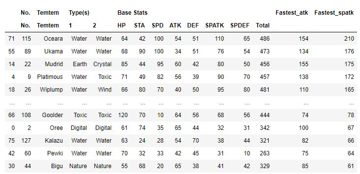
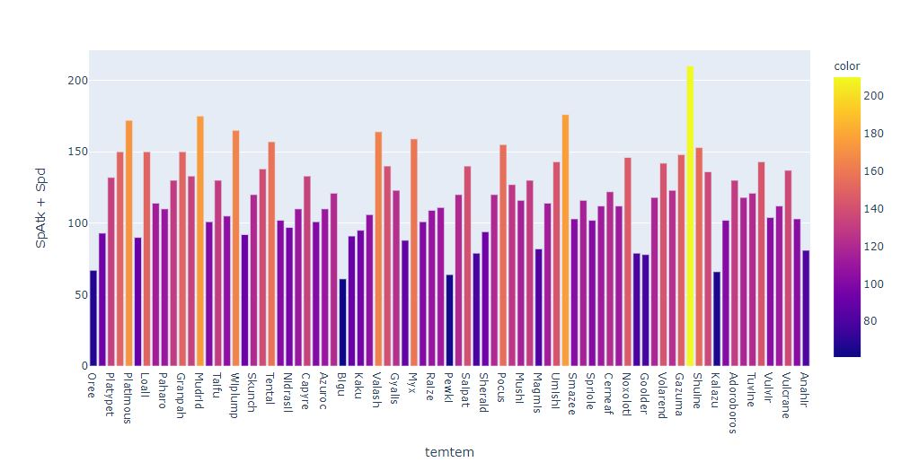

# Temtem Analysis
This was a quick project to analyze cratures known as Temtem from the videogame called, what do you know?, "Temtem". This game is very similar to pokemon, which you may be more familiar with. The game is a turn based game, therefor speed is important to move first and take less damage. So it goes without saying that high attack stats are not enough to be the best attacker. A combination of speed and attack are needed. There are two types of Attacks. Regualar physical attacks, and special attacks, and both each have their own corresponding stat values for each temtem. I did a very simple web scrape in pandas to get the stat values for each temtem from the temtempedia. The results of my analyis are in plotly bar graphs that show the best attackers and special attackers on a stat basis alone based on their cobination of speed and attack or special attack.\

## Best Physical Attackers based on a combination of Attack and Speed Stats
\

## Best Speecial Attackers based on a combination of Special Attack and Speed

